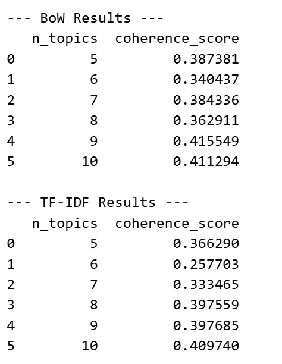
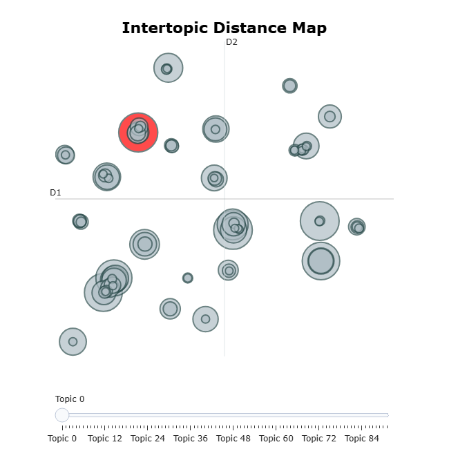
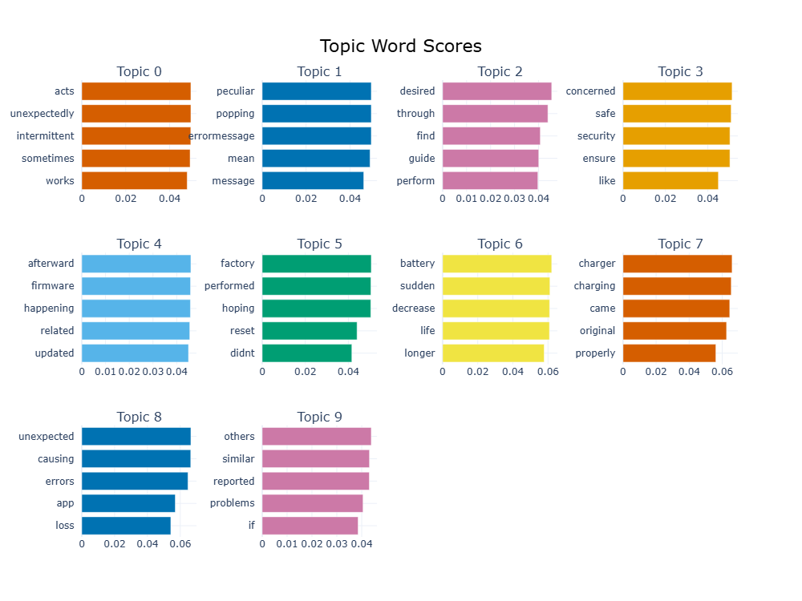

# Methodology

## EDA Insights and Preprocessing Pipeline:

The EDA of the ticket description corpus reveals the use of repeated most common words and phrases across the tickets indicates its a synthetic corpus with a lot of irrelevant information which makes it semantically more similar. The ticket categories across the ticket types and ticket subject are balanced makes the problem more as the classification rather than a clustering based problem. The average ticket length of the ticket description is around 50 words.
All preparation processes were created according to the EDA results using generalisable principles applicable to any support ticket corpus, avoiding dataset-specific hardcoding that would impair performance on unknown data.The preprocessing starts with lowercasing the words to ensure vocabulary consistency and prevent feature duplication, followed by contraction expansion, which converts informal forms. The NER token {product_purchased} placeholder is replaced with a “PRODUCT” NER token preserving sentence structure and semantic context without introducing product-specific bias. Regex rules then remove emails, ZIP codes, social media handles and standalone numbers noise patterns identified in EDA that distort vector representations without carrying issue relevant meaning. Word-level tokenization splits the cleaned text into tokens, followed by stopword removal using both standard and custom stopword generalized to the corpus. Then the tokens are lemmatized to reduce to their base form using part-of-speech context, which preserves the semantics in the sentences. 

The cleaned text was then passed through four vectorization branches Bag-of-Words (BoW), TF-IDF, pretrained Skip-gram and SBERT sentence embeddings forming the basis of the clustering and topic modelling pipelines described in the following sections.

## Embeddings & Vector Representations with PCA Projections:

The high-dimensional vector representations are reduced with PCA to two dimensions. The resulting 2D projections were plotted as scatter plots, colour-coded against two categorical labels, ticket type and ticket subject, enabling a visual assessment of each embedding method's discriminative capacity. 

Across all four embeddings, no clear cluster separation was observed by ticket type. BoW produced a dense central cluster with sparse outliers, reflecting shared common words without semantic distinction. TF-IDF generated a star-spike pattern, where high-frequency terms collapsed near the origin and unique terms radiated outward, yet still without type-based separation. Both SBERT and Skipgram embeddings collapsed into dense central regions due to high semantic similarity across ticket descriptions, rendering them insufficient for distinguishing ticket types. 

The ticket subject plotted against the ticket subject yielded no meaningful cluster separation across all embeddings. BoW and TF-IDF struggled identically because of shared vocabulary rather than subject-specific signals. SBERT's sentence-level compression and Skipgram's averaged word vectors both failed to preserve the discriminative features necessary to separate tickets by subject. 

The ticket corpus contains a high proportion of repeated common, persist even after custom stopword filtration impacts the quality of text representations. For BoW, shared template vocabulary produces near-identical count vectors across tickets, reducing inter-cluster distance. For TF-IDF, the inverse document frequency of the most frequent terms approaches zero since words appearing across the entire corpus are similar which reduces separability. For SBERT, the repeated sentence-level templates cause sentence embeddings to collapse into a dense central region, as the model compresses structurally similar sentences into nearly identical vector representations. For Skip-gram, averaging word-level embeddings across documents dominated by shared vocabulary produces similarly homogeneous document vectors, further reducing inter-cluster separation.

## Clustering Pipeline with Score comparisons and PCA Projection:

In this study, we build a clustering analysis pipeline to catch latent patterns within customer support tickets. The pipeline first transforms the cleaned text into four distinct feature representations: BoW, TF-IDF, Skip-gram, and SBERT. These vector spaces are fed into centroid-based KMeans and HAC, undergoing comprehensive iterative training across a cluster range from k=2 to 10.

During the model evaluation phase, we primarily utilized the Silhouette Score to measure the internal cohesion and external separation of the various clustering results. To verify whether these unsupervised clusters align with the ground-truth business metadata, we employed External Clustering Evaluation Metrics: Adjusted Rand Index (ARI) and Normalized Mutual Information (NMI) to measure the correspondence between the clustering results and the pre-assigned "Ticket Type" labels rigorously.

After multiple rounds of data cleaning, the improvement in the baseline model's silhouette score reached a bottleneck. To further mitigate the "curse of dimensionality" inherent in high-dimensional sparse features and to enhance the model's sensitivity to core semantics, we explored dimensionality reduction techniques. Specifically, in the preliminary experiments, we applied Latent Semantic Analysis (LSA via TruncatedSVD) combined with L2 normalization for the BoW and TF-IDF models, and PCA with L2 normalization for the SBERT dense vectors. However, in the final version, we removed this option after considering various factors. A detailed analysis and explanation can be found in the Evaluation section.

## Topic Modelling:

Topic modelling was used as the main issue-discovery component for uncovering latent complaint themes that are not fully reflected by the noisy ticket labels. Because the corpus contains repeated and template-like wording, we compared both **frequency-based** and **semantic** topic models rather than relying on a single representation. After preprocessing, the training corpus was modelled using **LDA** on sparse lexical features and **BERTopic** on SBERT sentence embeddings. For LDA, both **BoW** and **TF-IDF** document-term matrices were tested, and the number of topics was not fixed in advance; instead, the notebook evaluates **5–10 topics** and selects the better setting through coherence comparison. This makes the model choice evidence-driven: **BoW-LDA reaches its highest coherence at 9 topics (c_v = 0.4155)**, while **TF-IDF-LDA peaks at 10 topics (c_v = 0.4097)**. These results show that topic quality depends not only on representation but also on topic granularity, and they justify reporting the LDA coherence table rather than only describing the algorithm. 

**Figure 1 LDA coherence table** 

In parallel, **BERTopic** provides a semantic alternative that groups lexically different but meaningfully similar complaints. Its visual outputs also make the method more concrete: the topic overview shows that the largest discovered themes contain approximately **273, 269, 267, and 256** documents, while the corresponding bar chart highlights interpretable keyword sets such as *acts / unexpectedly / intermittent / sometimes / works* and *concerned / safe / security / ensure / like*. Together, these results show why topic modelling is a central analytical axis in the pipeline. 

**Figure 2 BERTopic topic overview** 

**Figure 3 BERTopic topic-word bar chart** 

## Sentiment Analysis:

Sentiment analysis sits alongside topic modelling as a second lens for reading customer support tickets,where topic modelling tells you what people are complaining about, sentiment captures how they feel doing it. That emotional layer adds a behavioural dimension that pure topic work tends to miss.

Each ticket gets a polarity score at document level, post-preprocessing. Those raw scores then get bucketed into three categories ie. positive, negative, or neutralusing a ±0.05 cutoff. The reasoning behind that threshold is pretty straightforward: short or messy text tends to throw off small score fluctuations that don't really mean anything, so it filters out the noise before anything gets overinterpreted.

Two lexicon-based tools do the heavy lifting here. VADER, which was built with short informal text in mind, picks up on things like capitalisation, punctuation intensity and negation,exactly the kind of signals that show up in complaint messages. TextBlob works differently,it draws on broader source material and reads as more of a general purpose baseline rather than something tuned for casual or frustrated language

Running both methods across clusters and topic groups lets the analysis surface patterns in emotional tone — which issue types reliably attract negative sentiment, which ones read as more matter of fact or neutral, and where the two tools agree or diverge. That contrast is where a lot of the useful signal ends up sitting.

## Hypotheses and Proposed Improvements for 2 analysis axes

For **topic modelling**, the main challenge is that the ticket corpus contains repeated, template-like language, which reduces lexical and semantic separation across documents. This is already reflected in our methodology, where the corpus is described as highly repetitive and difficult to separate cleanly in embedding space. To improve issue discovery under this condition, we compare **LDA** and **BERTopic**, and within LDA we further compare **Bag-of-Words** and **TF-IDF** representations.

Our first proposed improvement is to avoid relying on a single fixed LDA configuration. In the notebook, LDA is trained across a **topic-number sweep from 5 to 10**, rather than assuming one arbitrary value. This range is motivated by the dataset structure, since the corpus contains **5 ticket types** and **9 ticket subjects**, so the useful number of latent themes is likely to lie in a moderate region rather than at either extreme. The hypothesis is that a middle-range topic count will outperform both overly small and overly large settings: too few topics will merge distinct issues into broad categories, while too many will split similar complaints into unstable or redundant micro-topics.

Our second topic-modelling improvement is the comparison between **BoW-LDA** and **TF-IDF-LDA**. The hypothesis is that **TF-IDF-LDA will produce more interpretable and issue-specific topics**, because TF-IDF downweights the repeated high-frequency template words that appear across many tickets and gives more importance to terms that better distinguish one issue from another. However, BoW-LDA may still remain competitive in stability because LDA is fundamentally a count-based model. We therefore expect TF-IDF to improve interpretability, while BoW may provide slightly more stable topic distributions.

The third improvement is the introduction of **BERTopic**, which uses **SBERT embeddings** and class-based TF-IDF to build semantically informed topics. The hypothesis is that **BERTopic will better group tickets that describe similar problems using different wording**, making it more effective than LDA when lexical overlap is weak but semantic similarity is strong. At the same time, because our earlier analysis shows that SBERT embeddings can collapse into dense central regions on this repetitive corpus, we do not expect BERTopic to dominate in every respect; rather, we expect it to yield more meaningful topic summaries even if topic boundaries are not always sharply separated.

For **sentiment analysis**, the proposed improvement is to compare **VADER** and **TextBlob** rather than relying on a single polarity tool. According to our methodology, sentiment is used as a second analytical lens, complementing topic modelling by capturing how customers feel about the issues they raise. The hypothesis is that **VADER will perform better on support-ticket language**, because it is designed for short, informal text and is more sensitive to negation, emphasis, and frustration markers. By contrast, **TextBlob** is expected to act as a broader baseline, producing smoother but less complaint-sensitive sentiment estimates. We therefore expect VADER to detect stronger negative sentiment in customer complaints, while TextBlob may classify more tickets as neutral or mildly polarised. Together, these two methods should provide a more robust view of emotional tone across discovered issue categories.

## Hypotheses results and explanation

The hypothesis results are partially supported. For topic modelling, the notebook shows that varying LDA topic number was useful: the best BoW-LDA model achieved its highest coherence at 9 topics (0.4155), while the best TF-IDF-LDA peaked at 10 topiccompatible with its assumptions. BERTopic appears to produce more fine-grained semantic groupings, but the notebook also shows outlier assignments (-1), suggesting that its semantic flexibility comes with reduced compactness on this repetitive corpus.
For sentiment analysis, the hypothesis is more clearly supported. VADER assigns much stronger polarity than TextBlob: VADER labels 6000 tickets as positive and only 360 as neutral, whereas TextBlob produces a far more cautious distribution. Their agreement is only 45.63%, with weak-to-moderate score correlations (Pearson 0.3322, Spearman 0.3158). This confirms that VADER is more sensitive to complaint-style language, while TextBlob behaves as a smoother baseline.

## Overall of Methodology:

To summarize the insights gathered from the methodologies, the entire preprocessing pipeline was constructed to handle this synthetic dataset. Even after the stopwords and custom stopwords targeted for the datasets were removed from the ticket descriptions, the insights from the PCA projections on the vectors shows the more dense single cluster because of the shared vocabulary which limits natural spatial separation. Because of shared vocabulary, the clustering of the ticket corpus is less efficient with low silhouette scores which indicates the overlapping among the clusters. The two design axes topic modelling and semantic analysis to prove the hypothesis of clusters works better on increasing the number of clusters. BERTopic successfully captured finer semantic nuances despite some outlier assignments. Parallel sentiment analysis also confirmed our expectations, demonstrating VADER’s sensitivity to polarized, informal language against TextBlob’s cautious baseline. The upcoming section covers the evaluation of the trained model to test the hypothesis. 

## Evaluations :

We evaluate three different kinds of output, namely, cluster labels, topic distributions, and sentiment scores. There is no single metric that covers all three. So, to keep comparison fair, we use metrics suited to each and keep everything around them the same. We use one 80/20 train/test split with random_state=42 for topic modelling and downstream ranking. Clustering is applied to the entire dataset because it’s an unsupervised method, so splitting the data beforehand doesn’t add much value. For the rest of the pipeline, all vectorisers and embedding models are trained only on the training set and then kept fixed when applied to the test set. This ensures that features like TF-IDF weights and BERTopic representations are learned without any influence from the test data, preventing unintended information leakage. On top of the per-axis metrics below, three cross-method checks are run. First, we look at consistency, whether different approaches tend to group the same tickets together. Second, we assess coherence by checking if each group has clear and interpretable top-word summaries. Finally, we examine alignment, looking at how well these groupings match the existing Ticket Type and Subject labels.  

# EVALAUTION AND RESULTS:

## Entire evaluation of the project:

This part evaluates the two main axes (text representation and issue-discovery method). It does this using three groups of metrics, each targeting a specific question. 

 Firstly, for clustering, we look at both internal and external quality. Silhouette score measures how well-defined the clusters are without relying on labels, while ARI and NMI compare the clusters to the Ticket Type and Subject labels. Just to note, silhouette tends to favour more compact, convex clusters, which can put methods like Skipgram at a disadvantage. ARI adjusts for chance agreement, and NMI handles imbalanced data better, so we include both to give a more balanced view. 

Secondly, for topic modelling, we focus more on how understandable the topics are and how well the model generalises. We use c_v coherence as a rough measure of how interpretable the topics are, and perplexity on held-out data to check generalisation. c_v can be a bit unstable when the dataset is small, so we calculate it on the training data instead. That does reduce independence slightly, but it makes the results more stable. Also, perplexity only really applies to LDA, so for BERTopic we just use coherence and then manually inspect the topics as well. 

Lastly, for sentiment analysis, since there are no ground-truth labels, we’re comparing VADER and TextBlob against each other. We use three measures: agreement on positive/neutral/negative labels, Pearson correlation (for the actual score values), and Spearman correlation (for ranking). Agreement is easy to understand, but it depends quite a lot on the threshold we choose (±0.05), which can affect the results. Correlation avoids that, but it mixes together magnitude and ranking, so it’s not perfect either. Because of that, we report both to give a clearer overall picture. 

## Clustering Evaluations and Results:

In the clustering analysis, SBERT significantly outperformed traditional word-frequency methods. Specifically, SBERT-based HAC performed best at k=10, reaching a peak Silhouette coefficient of 0.252. This was followed by the SBERT-KMeans model, which showed clear local peaks at k=3 (0.216) and k=10 (0.222). In contrast, scores for BoW and TF-IDF were generally low, fluctuating only between 0.035 and 0.181. It is worth noting that at k=5, both BoW and TF-IDF models exhibited severe imbalance, assigning over 70% of the tickets to a single cluster. This comparison reveals that semantic models truly "understand" the deeper meaning behind the text, whereas traditional frequency models act more as mechanical counters, lacking a genuine grasp of the context.

However, despite SBERT’s strong performance in internal structural cohesion, the external evaluation metrics ARI and NMI remained near zero across all configurations. This indicates that the natural semantic clusters identified by the model are fundamentally different from the original classification logic of the business system. According to our previous analysis, we attribute this discontinuity to the extreme template homogeneity in the corpus. Because all tickets share a highly standardized language template, the textual content lacks sufficient differentiation, making it difficult for the model to recover the pre-assigned category labels based on descriptions alone.

After multiple rounds of data cleaning, the improvement in the baseline model's silhouette score reached a bottleneck. To further mitigate the "curse of dimensionality" inherent in high-dimensional sparse features and to enhance the model's sensitivity to core semantics, we explored dimensionality reduction techniques. Specifically, in the initial version testing, we applied Latent Semantic Analysis (LSA via TruncatedSVD) combined with L2 normalization for the BoW and TF-IDF models, and Principal Component Analysis (PCA) with L2 normalization for the SBERT dense vectors.

Experimental results show that, by compressing the SBERT embeddings from 384 to 80 dimensions yielded a significant improvement in the clustering silhouette score. However, the PCA output revealed that this reduction process resulted in a loss of approximately 15% of the explained variance. Although this 15% of marginal information is likely regarded as noise, in the specific context of customer support tickets, we cannot guarantee that these discarded variances do not conceal critical "minority complaints."

Furthermore, we deeply reflected on the mathematical limitations inherent to dimensionality reduction. The essence of dimensionality reduction is projecting information from a high-dimensional space onto lower-dimensional axes, which inevitably alters the absolute distances between the original data points. This raises a critical question: could two words with completely different meanings be projected onto the exact same low-dimensional coordinate? This is a risk we cannot definitively rule out.

Taking LSA based on TF-IDF as an example: from a positive perspective, because TF-IDF recognizes lexical forms rather than semantic meanings, different expressions passing the same intent often suffer from a massive "lexical gap." Here, LSA can extract latent semantics and successfully bridge this gap. However, from a risk perspective, LSA performs dimensionality reduction based on contextual co-occurrence. If two fundamentally different customer intents (requiring entirely different operational resolutions) share a similar context, and there exist imbalance in their data volumes, the algorithm in its pursuit of maximizing variance might force these two distinct issues to merge. In real-world ticket routing, this type of "semantic collapsing" caused by dimensionality reduction is an unacceptable operational error. In the end, out of concern for information integrity and business accuracy, we opted not to adopt this aggressive dimensionality reduction approach in the primary pipeline of our report.

IF TOO MANY WORD, THIS PARAGRAPH CAN BE DELATED[Additionally, we evaluated UMAP as a non-linear dimensionality reduction technique. The UMAP-transformed data exhibited an artificially inflated, dramatic surge in silhouette scores. While initially pleasantly surprised by such scores, a closer observation of the corresponding projections prompted deeper reflection: Why is the degree of clustering so extreme? Do these artificially high results carry any actual practical meaning? We decided to exclude it at last. The fundamental reason is that UMAP forcibly distorts the global topological structure to cluster local neighbors together, which inherently destroys the authentic Euclidean distance metrics. Calculating distance-dependent silhouette scores within this distorted space generates a severe "mathematical illusion" akin to overfitting, rendering the results entirely meaningless for guiding real-world business classifications. Although a little pity to abandon such high silhouette scores, we firmly believe that providing authentic, reliable, and interpretable clustering results from the original vector space is further more valuable than achieving meaningless high scores through algorithmic workarounds.]

## Axes report explanations:

The first axis is text representation, BoW, TF-IDF, Skipgram and SBERT. The idea here is that methods which capture sentence meaning should do better than just counting words, especially since the dataset is quite templated and repetitive. 

The second axis is the issue-discovery method, comparing LDA (using BoW and TF-IDF) with BERTopic. We expected BERTopic to do better here since it uses SBERT underneath, so in theory it should give more coherent topics than bag-of-words LDA. 

## Error analysis: 

Each axis has one main issue. 

Clustering. At k=5, TF-IDF puts 58.6% of tickets (4,965/8,469) into one cluster, and BoW is worse (73.8%). These are mostly template-heavy tickets with the {product_purchased} placeholder. Smaller clusters just have more unusual wording. Using the same KMeans with SBERT gives a balanced split, so this looks like a representation issue, not the algorithm. 

Topic modelling. LDA struggles with short tickets where words like login, payment, and download appear together, so it spreads probability across topics. BERTopic does the opposite and pushes many of these into the outlier group (topic −1). They fail in different ways.

Sentiment. VADER and TextBlob often disagree on moderate cases. VADER picks up frustration (e.g. negation), while TextBlob reads the same text as neutral. They’re capturing different signals. 

## Discussions and interpretation:

First, semantic methods do better than frequency-based ones here. SBERT gets silhouette 0.17 to 0.25, while BoW (0.05–0.18), TF-IDF (0.04–0.14) and Skipgram (0.05–0.11) are all lower. This is a bit unusual, but it comes from the data being very templated. TF-IDF downweights common words like *support* and *issue*, which ends up removing useful signal and leaving mostly noise.

Second, none of the methods recover Ticket Type from the text. ARI and NMI are basically zero across all setups. The EDA cross-tabs show Ticket Type was assigned by process, not by content, so this isn't a model failure but a property of the dataset.

Third, there is still structure in the data, just not along Ticket Type. SBERT's higher silhouette, consistent LDA topics, and some overlap between LDA and SBERT clusters point to groupings based on issue theme, like payment, connectivity, access, hardware and software. So here, unsupervised methods are more useful than the existing labels.